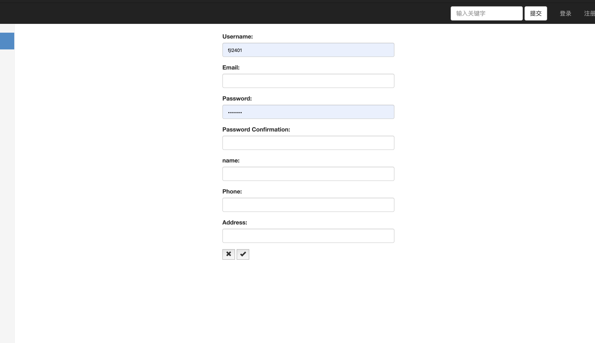
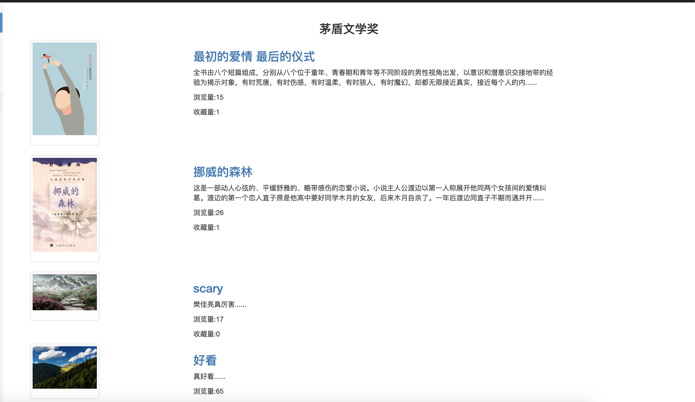
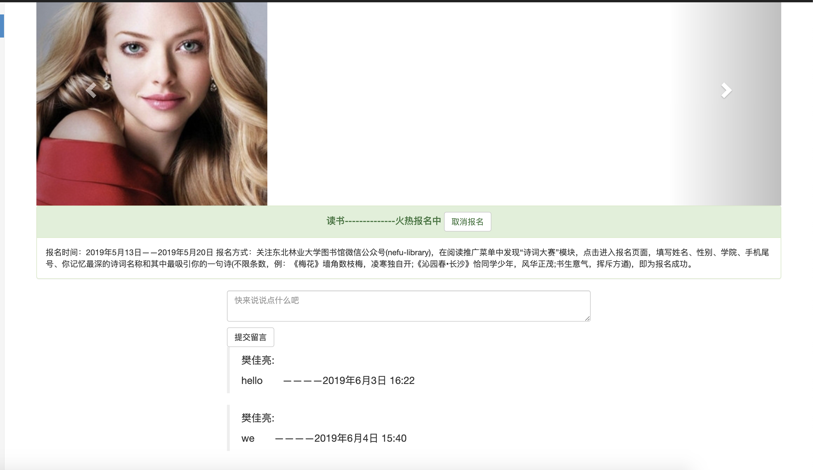
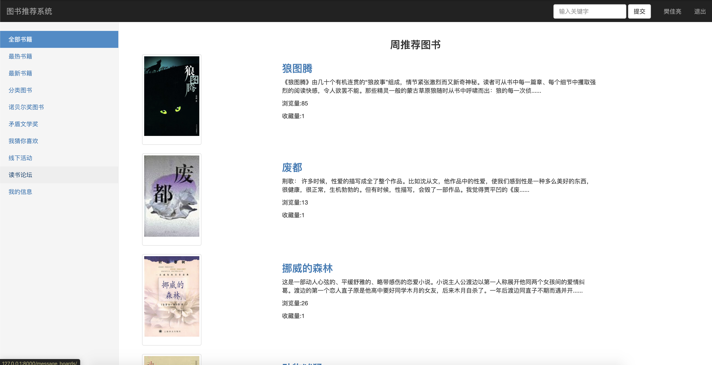

# 毕业设计--基于Django的图书推荐系统和论坛

## feature

1.	登录注册页面
2.	基于协同过滤的图书的分类，排序，搜索，打分功能
3.	基于协同过滤的周推荐和月推荐
4. 读书分享会等活动功能，用户报名功能
5. 发帖留言论坛功能

## fixed

1. 首页导航栏链接错误
2. 首页面为空
3. 登录注册页面
4. 推荐跳转登录
5. 周推荐用户没有评分时随机推荐
6. 按照收藏数量排序
7. 重新设计了 action 和UserAction model，拆分出了UserAction

## 书模型

1. 浏览量 每次刷新页面的浏览数
2. 收藏量 user manytomany field 每个用户收藏一次
3. 评分   rate 每个用户评分一次
4. 在书籍下面的评论加点赞功能

### 注册和登录

### 推荐

### 论坛

### 周推荐

## 安装运行方法

pip install -r requirements.txt

python manage.py runserver
